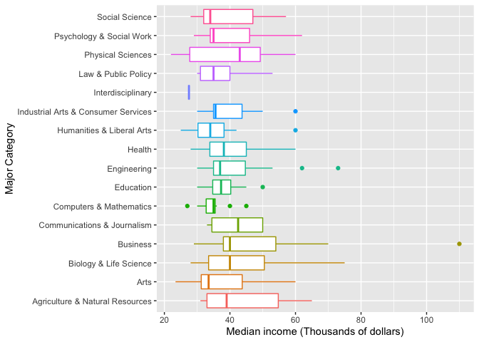

<br/><br/><br/><br/>


##### 0 - Load Libraries


```r
devtools::install_github("jhudsl/collegeIncome")
devtools::install_github("jhudsl/matahari")
```


```r
library(tidyverse)
library(janitor)
library(GGally)
```

<br/><br/><br/><br/>


##### 1 - Load Data

```r
data(college)
```

<br/><br/><br/><br/>


##### 2 - Descriptive Statistics

```r
dim(college)
```

```
## [1] 173  19
```

```r
glimpse(college)
```

```
## Rows: 173
## Columns: 19
## $ rank                             <int> 1, 2, 3, 4, 5, 6, 7, 8, 9, 10, 11, 12…
## $ major_code                       <int> 2419, 2416, 2415, 2417, 2405, 2418, 6…
## $ major                            <chr> "Petroleum Engineering", "Mining And …
## $ major_category                   <chr> "Engineering", "Engineering", "Engine…
## $ total                            <int> 2339, 756, 856, 1258, 32260, 2573, 37…
## $ sample_size                      <int> 36, 7, 3, 16, 289, 17, 51, 10, 1029, …
## $ perc_women                       <dbl> 0.91093257, 0.51540645, 0.59420765, 0…
## $ p25th                            <dbl> 25000, 26000, 26700, 26000, 31500, 23…
## $ median                           <dbl> 40000, 37000, 45000, 35000, 62000, 44…
## $ p75th                            <dbl> 50000, 40000, 60000, 45000, 109000, 5…
## $ perc_men                         <dbl> 0.08906743, 0.48459355, 0.40579235, 0…
## $ perc_employed                    <dbl> 0.9115044, 0.7980501, 0.7871943, 0.84…
## $ perc_employed_fulltime           <dbl> 0.9206524, 0.7110092, 0.8833498, 0.93…
## $ perc_employed_parttime           <dbl> 0.1774785, 0.3623853, 0.3387257, 0.16…
## $ perc_employed_fulltime_yearround <dbl> 0.7704431, 0.7093101, 0.7738366, 0.65…
## $ perc_unemployed                  <dbl> 0.08849558, 0.20194986, 0.21280567, 0…
## $ perc_college_jobs                <dbl> 0.6702970, 0.3867764, 0.7289116, 0.24…
## $ perc_non_college_jobs            <dbl> 0.1821782, 0.5158761, 0.1759983, 0.41…
## $ perc_low_wage_jobs               <dbl> 0.05544554, 0.21560172, 0.03014828, 0…
```

**How many majors / major categories do we have?**


```r
college %>% select(major) %>% n_distinct()
```

```
## [1] 173
```

```r
college %>% select(major_category) %>% n_distinct()
```

```
## [1] 16
```

```r
sort(table(college$major_category))
```

```
## 
##                   Interdisciplinary         Communications & Journalism 
##                                   1                                   4 
##                 Law & Public Policy Industrial Arts & Consumer Services 
##                                   5                                   7 
##                                Arts            Psychology & Social Work 
##                                   8                                   9 
##                      Social Science     Agriculture & Natural Resources 
##                                   9                                  10 
##                   Physical Sciences             Computers & Mathematics 
##                                  10                                  11 
##                              Health                            Business 
##                                  12                                  13 
##              Biology & Life Science           Humanities & Liberal Arts 
##                                  14                                  15 
##                           Education                         Engineering 
##                                  16                                  29
```

We can see that we have

* 173 Majors
* 15 Major Categories
  * which range from having 1, to 29 participants


```r
#look at the average median incomes by major_category
average_median_incomes <- college %>%
  select(major_category, median) %>%
  group_by(major_category) %>%
  summarise(median_mean = mean(median, na.rm = TRUE)) %>%
  arrange(desc(median_mean))

average_median_incomes
```

```
## # A tibble: 16 x 2
##    major_category                      median_mean
##    <chr>                                     <dbl>
##  1 Business                                 49154.
##  2 Biology & Life Science                   43864.
##  3 Agriculture & Natural Resources          43500 
##  4 Communications & Journalism              42000 
##  5 Industrial Arts & Consumer Services      40429.
##  6 Physical Sciences                        40400 
##  7 Engineering                              40393.
##  8 Health                                   40317.
##  9 Psychology & Social Work                 39889.
## 10 Social Science                           39067.
## 11 Arts                                     38050 
## 12 Education                                37938.
## 13 Law & Public Policy                      37800 
## 14 Humanities & Liberal Arts                35167.
## 15 Computers & Mathematics                  34718.
## 16 Interdisciplinary                        27500
```

We can see by looking at the average of median incomes (by major category) that higher median incomes are associated with

1. Business
2. Biology & Life Science
3. Agriculture & Natural resources

<br/><br/><br/><br/>


##### 3 - EDA

We will now use a box-plot to look at the distribution of of incomes for each major_category


```r
g <- ggplot(college, aes(x=major_category,
                         y=median / 1000,
                         color = major_category))
g <- g + geom_boxplot()
g <- g + coord_flip()
g <- g + ylab("Median income (Thousands of dollars)")
g <- g + xlab("Major Category")
g <- g + theme(legend.position = "none")
g
```

<!-- -->

The distribution of median incomes doesn't show any discernable pattern. But we can see that **Business** appears to be highest overall.

<br/><br/><br/><br/>


##### 4 - Modelling

Here, we generate a Regression Model, with `major category` regressed


```r
fit <- lm(median ~ major_category, data=college)
round(summary(fit)$coef, 2)
```

```
##                                                    Estimate Std. Error t value
## (Intercept)                                        43500.00    3590.82   12.11
## major_categoryArts                                 -5450.00    5386.23   -1.01
## major_categoryBiology & Life Science                 364.29    4701.49    0.08
## major_categoryBusiness                              5653.85    4776.24    1.18
## major_categoryCommunications & Journalism          -1500.00    6717.81   -0.22
## major_categoryComputers & Mathematics              -8781.82    4961.43   -1.77
## major_categoryEducation                            -5562.50    4577.41   -1.22
## major_categoryEngineering                          -3106.90    4164.15   -0.75
## major_categoryHealth                               -3183.33    4861.99   -0.65
## major_categoryHumanities & Liberal Arts            -8333.33    4635.73   -1.80
## major_categoryIndustrial Arts & Consumer Services  -3071.43    5595.89   -0.55
## major_categoryInterdisciplinary                   -16000.00   11909.40   -1.34
## major_categoryLaw & Public Policy                  -5700.00    6219.48   -0.92
## major_categoryPhysical Sciences                    -3100.00    5078.18   -0.61
## major_categoryPsychology & Social Work             -3611.11    5217.34   -0.69
## major_categorySocial Science                       -4433.33    5217.34   -0.85
##                                                   Pr(>|t|)
## (Intercept)                                           0.00
## major_categoryArts                                    0.31
## major_categoryBiology & Life Science                  0.94
## major_categoryBusiness                                0.24
## major_categoryCommunications & Journalism             0.82
## major_categoryComputers & Mathematics                 0.08
## major_categoryEducation                               0.23
## major_categoryEngineering                             0.46
## major_categoryHealth                                  0.51
## major_categoryHumanities & Liberal Arts               0.07
## major_categoryIndustrial Arts & Consumer Services     0.58
## major_categoryInterdisciplinary                       0.18
## major_categoryLaw & Public Policy                     0.36
## major_categoryPhysical Sciences                       0.54
## major_categoryPsychology & Social Work                0.49
## major_categorySocial Science                          0.40
```

The model which regresses median income onto major categories, is showing *Agriculture & Natural Resources* as an intercept (our referenced major category). 

The other coefficients show the difference of the mean from that category, to our reference category. 

The p-value of the coefficients is the probability of a t-test where the mean of each coefficient is compared with the mean of the reference variable.

**Model Interpretation**

* Mean of median income for students of *Argriculture & Natural Resources* $43,500
* Difference in means (of median income) between *Argiculture & Natrual Resources* and *Business* is $5,653.85.
  * This is the highest largest mean difference of all major categories.
  

**Checking Model validity**


```r
par(mfrow=c(2,2))
plot(fit)
```

<!-- -->

These diagnostic plots do not reveal any worrying patterns within the residuals, and the data seems nearly normal.


**Comparison of the "Business" variable**


```r
business_college <- relevel(as.factor(college$major_category), "Business")
fit2 <- lm(median ~ business_college, college)
round(summary(fit2)$coef, 2)
```

```
##                                                      Estimate Std. Error
## (Intercept)                                          49153.85    3149.36
## business_collegeAgriculture & Natural Resources      -5653.85    4776.24
## business_collegeArts                                -11103.85    5102.54
## business_collegeBiology & Life Science               -5289.56    4373.61
## business_collegeCommunications & Journalism          -7153.85    6492.56
## business_collegeComputers & Mathematics             -14435.66    4651.91
## business_collegeEducation                           -11216.35    4239.95
## business_collegeEngineering                          -8760.74    3790.07
## business_collegeHealth                               -8837.18    4545.70
## business_collegeHumanities & Liberal Arts           -13987.18    4302.84
## business_collegeIndustrial Arts & Consumer Services  -8725.27    5323.38
## business_collegeInterdisciplinary                   -21653.85   11783.81
## business_collegeLaw & Public Policy                 -11353.85    5975.48
## business_collegePhysical Sciences                    -8753.85    4776.24
## business_collegePsychology & Social Work             -9264.96    4923.93
## business_collegeSocial Science                      -10087.18    4923.93
##                                                     t value Pr(>|t|)
## (Intercept)                                           15.61     0.00
## business_collegeAgriculture & Natural Resources       -1.18     0.24
## business_collegeArts                                  -2.18     0.03
## business_collegeBiology & Life Science                -1.21     0.23
## business_collegeCommunications & Journalism           -1.10     0.27
## business_collegeComputers & Mathematics               -3.10     0.00
## business_collegeEducation                             -2.65     0.01
## business_collegeEngineering                           -2.31     0.02
## business_collegeHealth                                -1.94     0.05
## business_collegeHumanities & Liberal Arts             -3.25     0.00
## business_collegeIndustrial Arts & Consumer Services   -1.64     0.10
## business_collegeInterdisciplinary                     -1.84     0.07
## business_collegeLaw & Public Policy                   -1.90     0.06
## business_collegePhysical Sciences                     -1.83     0.07
## business_collegePsychology & Social Work              -1.88     0.06
## business_collegeSocial Science                        -2.05     0.04
```

When we compare the `major_category` Business to the other categories, we see a clear difference with some other categories. For example
* Arts
* Computers & Mathematics
* Education
* Engineering
* Humanities & Liberal Arts
* Science
all have negative coefficients, with significantly small p-values (p<0.05)

<br/><br/><br/><br/>


##### Conclusion

This analysis looked at the question of whether there was any difference in income, based on college major.

In order to answer this question, we looked at `median` income, by `major category`.

**Null Hypothesis**

We began with the assumption of *no difference* in income between the major categories. 

The alternative hypothesis, is that there was a difference in mean income between the categories. 


Our regression models show that in general, there is no significant difference in income across major categories. 

We do see **Business** as significantly higher than some other categories, including *Arts, Computers & Mathematics, Education, Engineering, Humanities & Liberal Arts, and Social Science*.

Further analysis would be required to validate and verify if this is a real difference, or just due to chance.
